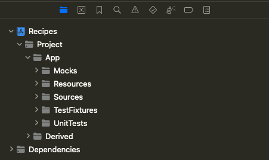
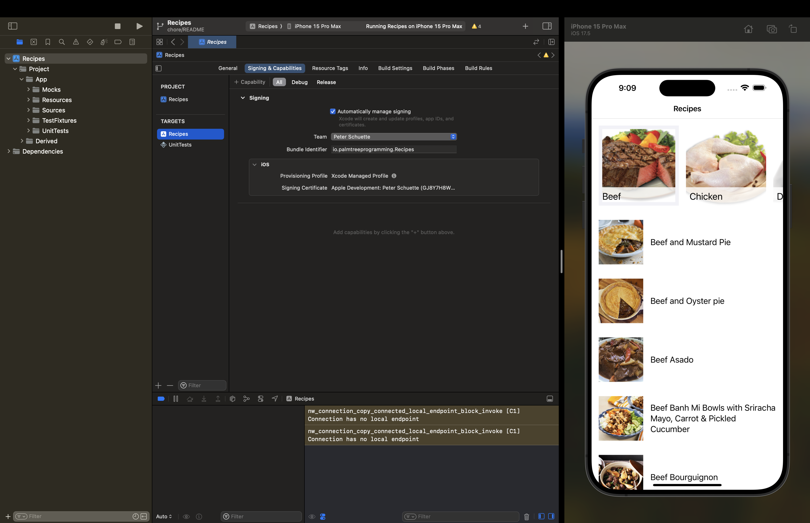
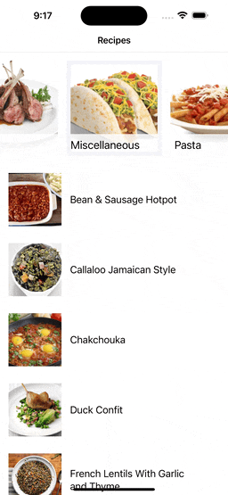

# Recipes
An app for Recipes!

## Setup
The Recipes app is assembled using [Tuist](https://tuist.io/). It can be installed via `make install-tuist` command (preferred), or directly from the [ official tuist install guide](https://docs.tuist.io/guides/quick-start/install-tuist).

#### Once installed, run `make project`

Results this project structure

Select a signing certificate and run the App

## Usage
### Categories
The initial page is a list of recipes organized by category.

### Recipe Details
Tapping on a recipe from the list will present the recipe details where you will find a list of ingredients and instructions.

